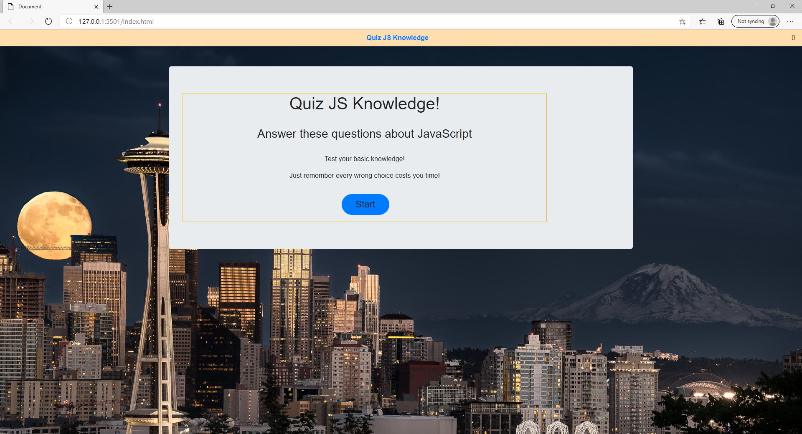
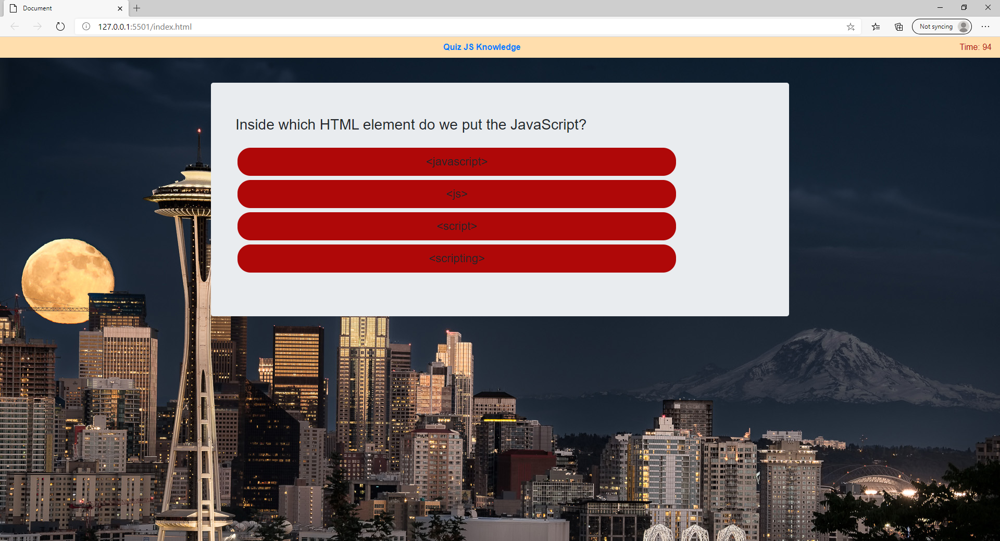

## 03 JavaScript: Password Generator

### Description of project

The quiz game was developed using bootstrap and javascript, it have a clean, polished, and responsive user interface. The game consist in multiple choice questions with timer and posibility to save the score and display the high score list. High score list will be saved in local storage, you can play later without loosing the score list.

### How to use?
* WHEN I click the start button
* THEN a timer starts and I am presented with a question
* WHEN I answer a question
* THEN I am presented with another question
* WHEN I answer a question incorrectly
* THEN time is subtracted from the clock
* WHEN all questions are answered or the timer reaches 0
* THEN the game is over
* WHEN the game is over
* THEN I can save my initials and my score

## Instructions
* 'Play Now' button to play.
* Once started, read the question and choose one answer.
* After time is out or answered all questions you'll get the Score and the possibility to play again.
* Below you can register your score.

## Credits
* List of the resources used to complete this project:
    * - [Bootstrap](https://getbootstrap.com/)
    * - [W3Schools](https://www.w3schools.com/) 
    * - [Html validator](https://validator.w3.org/nu/#textarea)
    * - [Git Hub](https://github.com/)
*

##### Contributors:

* matachemarius92@gmail.com
* [Matache Marius](https://github.com/MatacheMarius)
##### Directory:
* [Current Repository](https://github.com/MatacheMarius/h4_Quiz-Game-JS)
* [Website](https://matachemarius.github.io/h4_Quiz-Game-JS/)

